# Project: Robot Assembly and Documentation

## General Description

The goal of this project is the assembly and documentation of a laboratory robot, using GitHub for version control and documentation.

The robot used in this project is:

Lynxmotion SES-V2 Robotic Arm (3 DoF) w/ Smart Servos Kit  
https://eu.robotshop.com/products/lynxmotion-lss-3-dof-robotic-arm-kit

# Project: Assembly of the Lynxmotion LSS 3 DoF Arm

## Author
- Name: Coco  
- Motto: *One step toward the future, one robotic arm for humanity.*

## General Description
The goal of this project is the assembly and testing of the Lynxmotion LSS 3 DoF Arm during the APD laboratory sessions.

The documentation includes:

- assembly steps  
- hardware configuration  
- testing process  
- possible improvements

The robot used in this project is:

Lynxmotion SES-V2 Robotic Arm (3 DoF) w/ Smart Servos Kit  
https://eu.robotshop.com/products/lynxmotion-lss-3-dof-robotic-arm-kit

---

# Components List - Lynxmotion LSS 3 DoF Arm

| Nr | Image | Component | Code/Name | Quantity | Notes |
|:--:|:---:|:---|:---|:--:|:---|
| **A** | | **Screws** | | | |
| 1 |  | Screw 2-56 1/4" | `PHS-02` | 27 | Imperial |
| 2 |  | Screw M3 10mm | `PHS-16` | 2 | Metric |
| 3 |  | Screw M3 20mm | `PHS-17` | 4 | Metric |
| 4 |  | Screw M3 30mm | `PHS-18` | 2 | Metric |
| 5 |  | Screw M3 40mm | `PHS-19` | 2 | Metric |
| 6 |  | Screw 2-56 1/2" | `PHS-05` | 12 | Imperial |
| 7 |  | Self-tapping screw #2 | `PHTS-01` | 15 | #2 x 1/4" |
| 8 |  | Washers | `SW-04` | 26 | 3 x 5.6mm |
| 9 |  | Nuts | `SLN-03` | 8 | M3 Locknut |

| **B** | | **Metal Brackets** | | | |
| 10 |  | Wide Bracket | `ASB-28` | 2 | Single Wide |
| 11 |  | Mini C Bracket | `ASB-43` | 1 | Mini C |
| 12 |  | Zip Ties | `ZT-07in` | 4 | Cable management |
| 13 |  | Electronic Clips | `AHS-EC` | 2 | Cable holder |

| **C** | | **Structure** | | | |
| 14 |  | Arm Segment #1 | `LSS-3DOF-L-01` | 1 | Link #1 |
| 15 |  | Arm Segment #2 | `LSS-3DOF-L-02` | 5 | Link #2 |
| 16 |  | Arm Segment #3 | `LSS-3DOF-L-03` | 1 | Link #3 |
| 17 |  | Arm Segment #4 | `LSS-3DOF-L-04` | 2 | Link #4 |
| 18 |  | Arm Segment #5 | `LSS-3DOF-L-05` | 1 | Link #5 |
| 19 |  | Arm Segment #6 | `LSS-3DOF-L-06` | 1 | Link #6 |
| 20 |  | Base Plate | `LSS-3DOF-BP` | 1 | Robot base |
| 21 |  | Back Support | `LSS-3DOF-BS` | 1 | Rear support |
| 22 |  | Small Cable Support | `LSS-3DOF-CT-S` | 2 | Cable guide |
| 23 |  | Large Cable Support | `LSS-3DOF-CT-L` | 2 | Cable guide |

---

# Step-by-step Assembly

This section describes the mechanical and electronic assembly process of the Lynxmotion LSS 3 DoF Arm using images taken during the laboratory work.

---

### Step 1 – Component Verification

Before starting the assembly process, all parts were checked and verified according to the official kit component list.

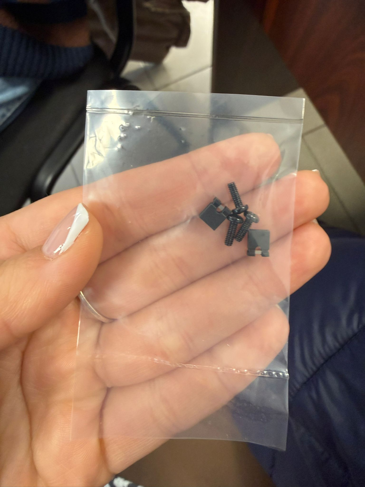
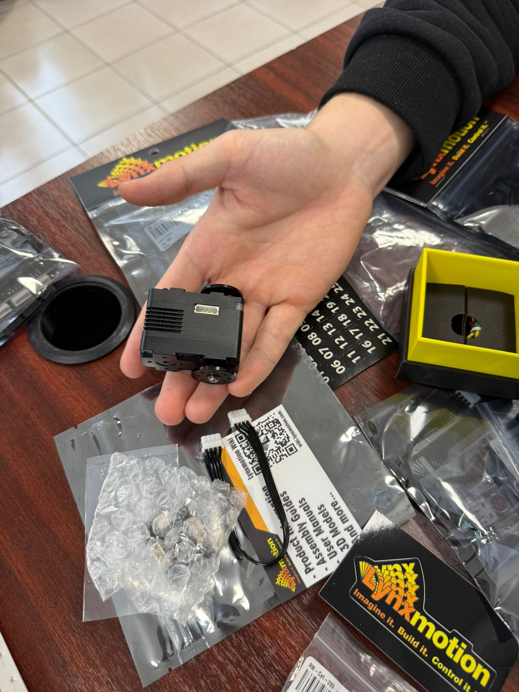
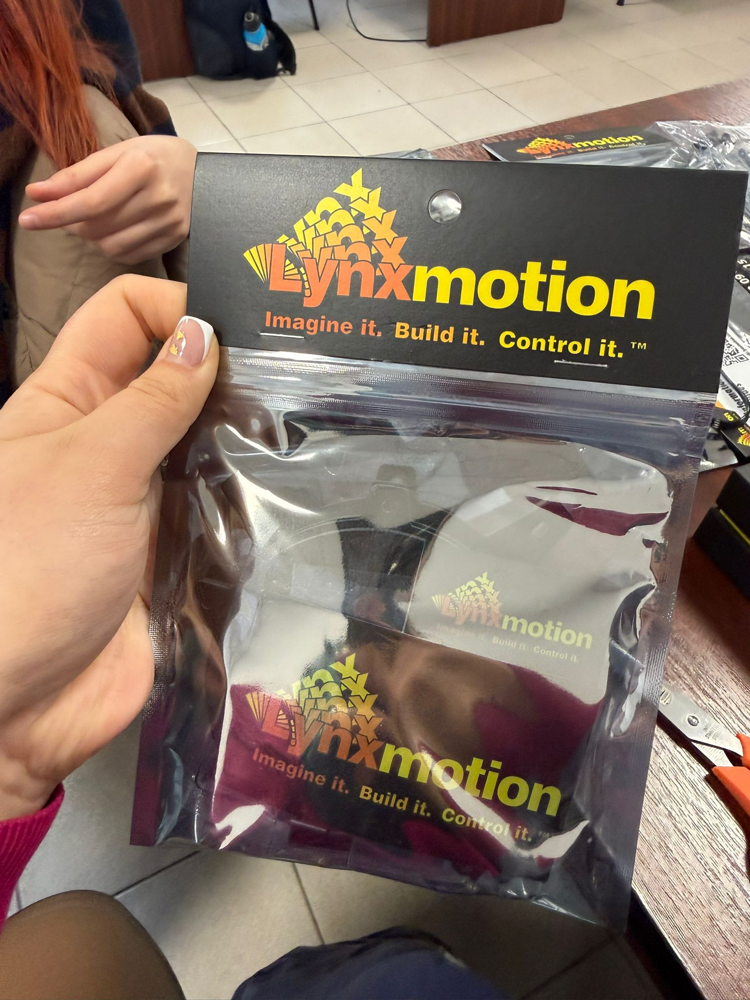
  
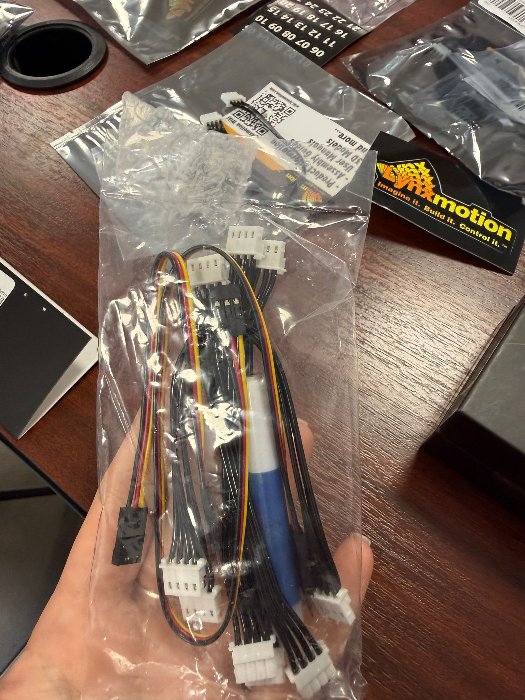
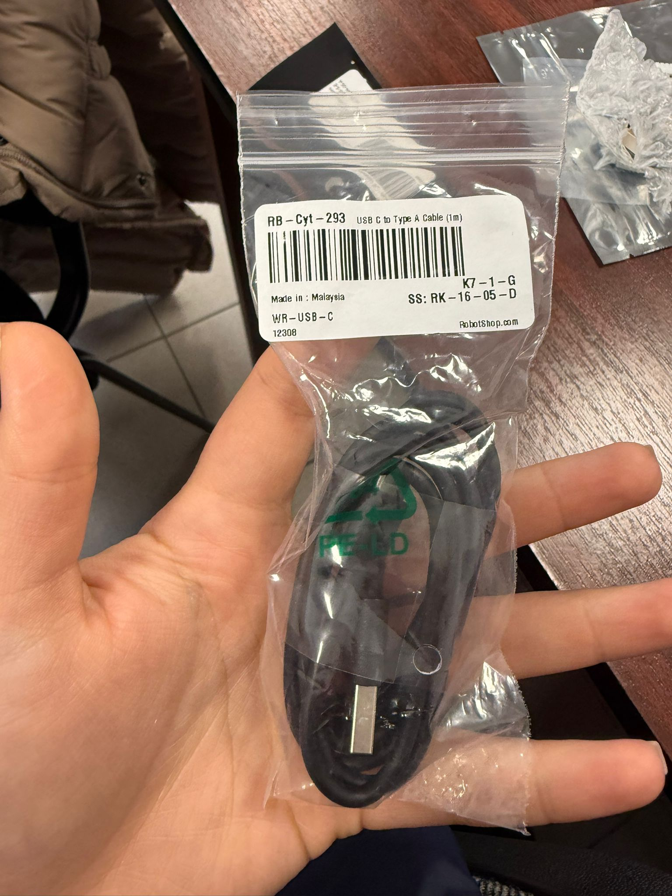
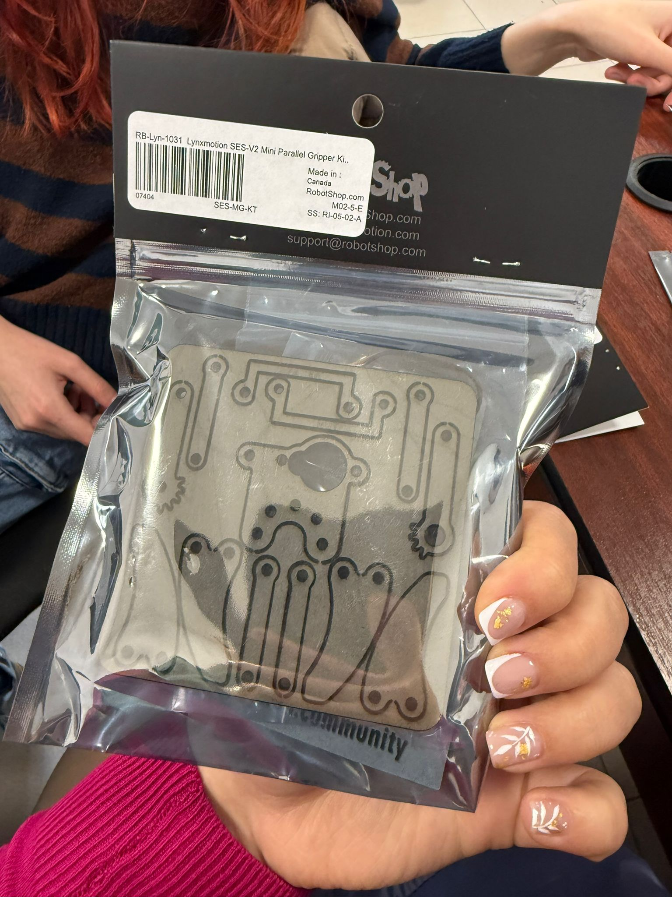
  

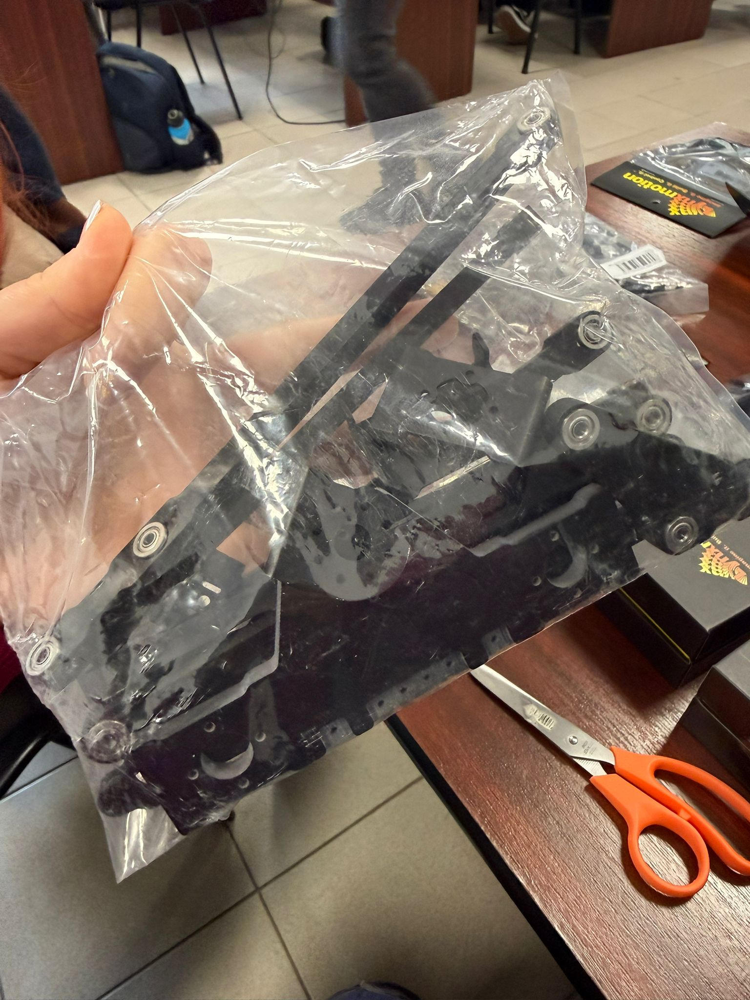

<strong><em>Verification of all components before assembly:</em></strong>

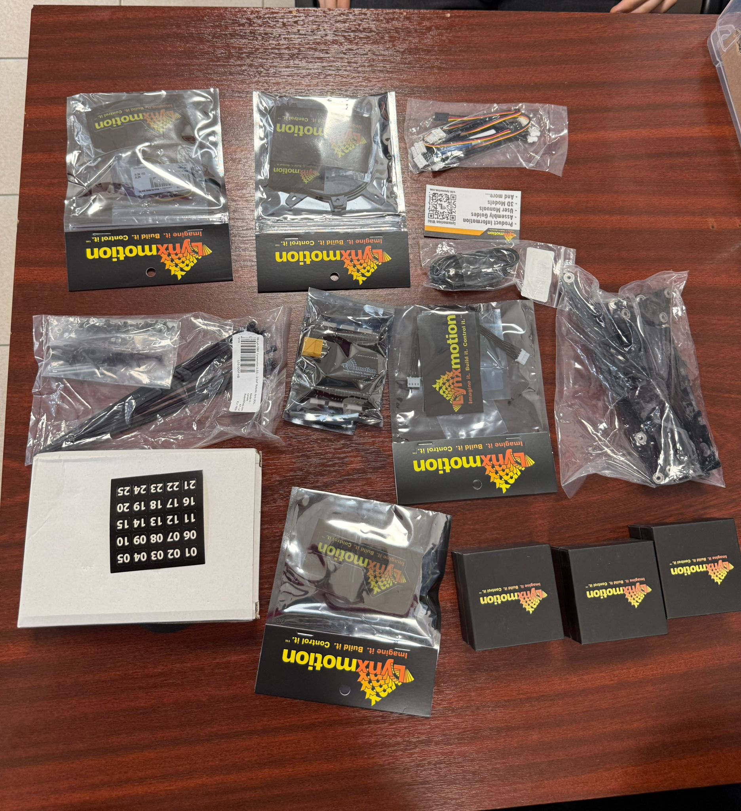

---

### Step 2 – Robot Base Assembly

<b>The base plate (LSS-3DOF-BP) and the rotation support were mounted and fixed using the correct screws to ensure the stability of the robot.</b>

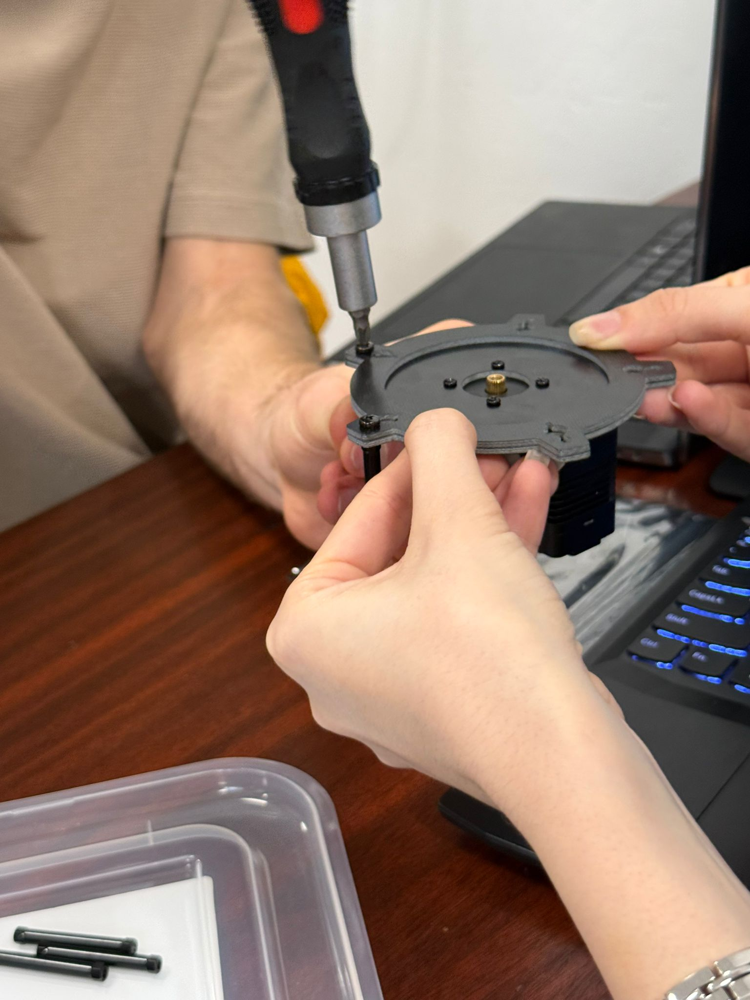

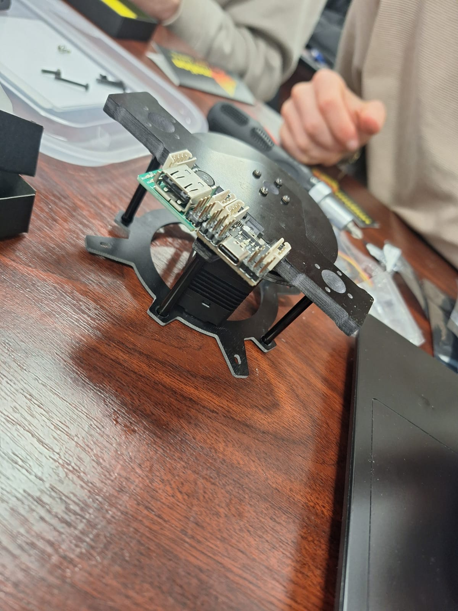
 
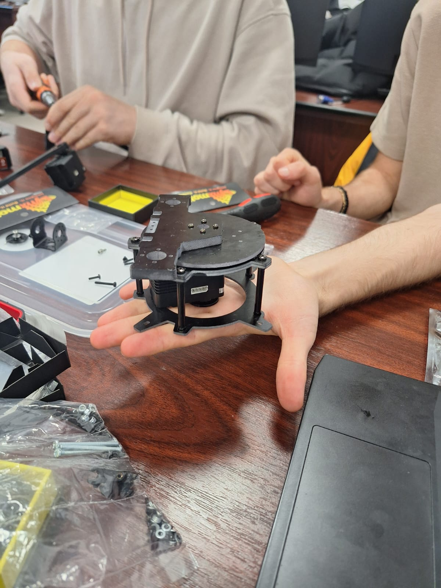

---

### Step 3 – Arm Segment Assembly

<b>The arm segments were connected using metal brackets and screws, forming the structure of the robotic arm.</b>

  

  

  

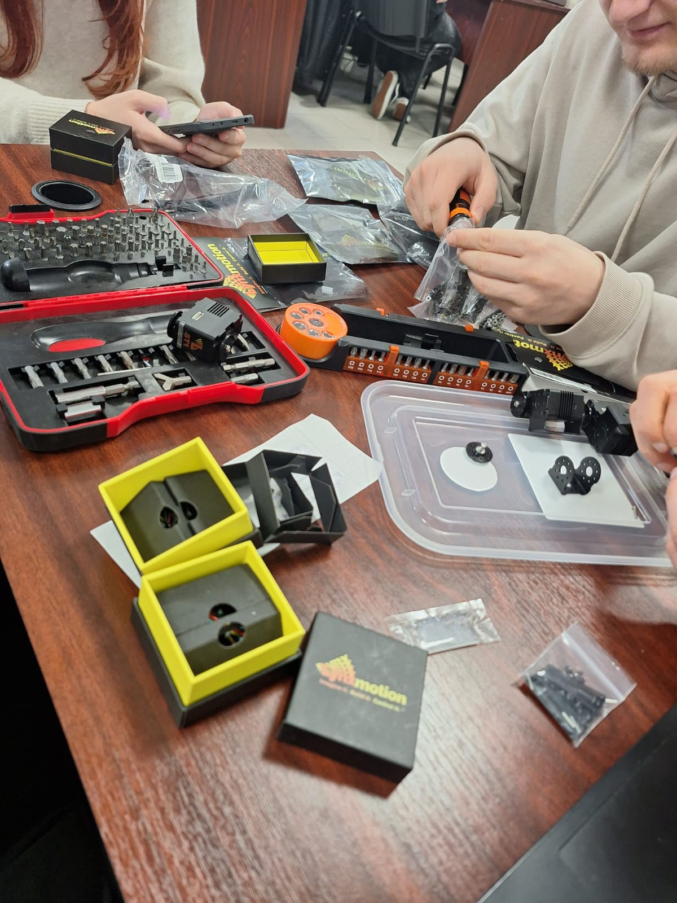
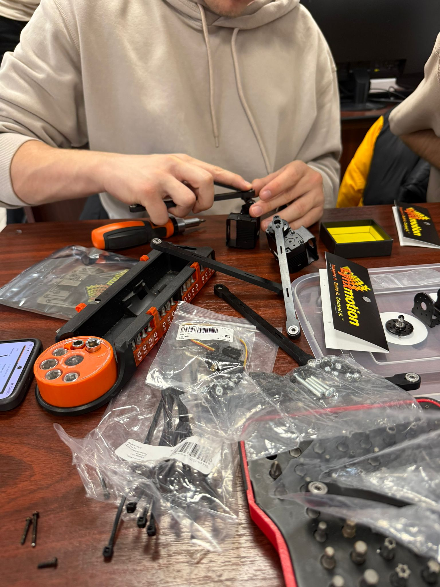

---

## Software Configuration

Platform:  
LSS FlowArm (Windows GUI control software)

Example run:  
https://www.youtube.com/watch?v=SLJi2BDQgF8

---

# Compile and Upload

TODO

# ETC

---

## Progress

## Project Progress

| Nr | Stage | Short Description | Status |
|:--:|:------|:-----------------|:------:|
| 1 | Component verification | Checking all parts and verifying integrity | ✅ |
| 2 | Mechanical assembly | Base assembly, servo mounting, screws | ✅ |
| 3 | Electronic connections | Connecting controller, cables, power supply | ❌ |
| 4 | Initial motion test | Testing basic robot movements | ❌ |
| 5 | Software configuration | Installing libraries, uploading code, calibration | ❌ |
| 6 | Final testing | Complete verification of robot functionality | ❌ |
| 7 | Documentation and images | Writing README, adding photos and useful links | ✅ |
| 8 | Final presentation | Functional demonstration in the laboratory | ⏳ |

Legend:  
✅ Completed  
⏳ In progress  
❌ Not started
